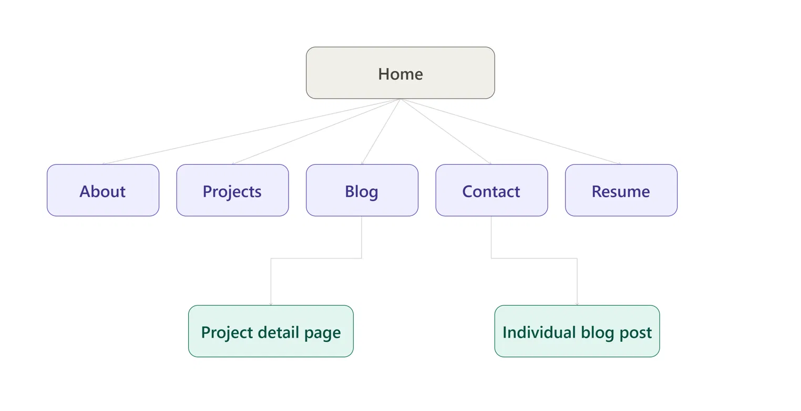

**Proof Statement:**

_"I take a problem from raw, messy, or unlabelled data through to a working, evaluated model — as shown by self-labeling sparse satellite imagery to detect landslides, and fine-tuning Llama2 on heterogeneous code data for a code-generation task. I'm looking to connect with hiring managers at early-stage startups who need someone who can take a messy, ill-defined ML problem and turn it into a working solution. If that's you: email me."_

**One-line why:**

_"GitHub scatters my projects with no throughline — it can't show that I take on messy, real-world-constrained problems and carry them to a working, evaluated model; this portfolio makes that pattern explicit and lets you assess the reasoning, not just the code."

## The Through-Line Map Content & CTAs
**Home**

1. Claim (hero) — your one-liner, big, alone
2. Proof strip — one line + your Pass@1/Pass@5 numbers, no fluff
3. Featured project — the Llama2 fine-tuning case, one paragraph + result number
4. CTA: **Email me**

**About**

1. Photo + short bio (your two-sentence bio)
2. How you work — the "just me / delegate / collaborate" fluency angle (shows process, not just output)
3. CTA: **Email me**

**Projects (listing)**

1. Llama2 fine-tuning (lead — strongest, has real numbers)
2. Other projects in descending strength
3. CTA per card: **See the case study**

**Project detail (Llama2 case)**

1. Problem (privacy + cost)
2. What you did (QLoRA, data curation, chat-model pivot)
3. What failed (base model attempt)
4. Result (Pass@1/5, BLEU, CodeBLEU)
5. What's next (bigger data, RL)
6. CTA: **Email me** / **View repo**

**Blog (listing)**

1. Posts newest-first
2. CTA per post: **Read more**

**Individual blog post**

1. Post content
2. CTA at end: **Email me**

**Contact**

1. Short line + email link
2. CTA: **Email me** (final ladder point)

**Resume**

1. Embedded PDF / download link
2. CTA: **Email me**

### Proof — still need to gather (updated)

**Have already:**

- ✅ Repo — public, code + model both shareable, people can try it themselves
- ✅ Screenshots — already collected

**Still need:**

- Live demo link
- before/after examples
- testimonial

**In progress

- FL-ML internship track 
- Landslide image segmentation project 

Portfolio Style Guide

Fonts

Headings: Fraunces, weight 600 — H1: 48px, H2: 32px, H3: 22px
Body: Source Sans 3, weight 400 — 17px, line-height 1.6
Small labels/captions: Source Sans 3, weight 500, uppercase, 13px, letter-spacing 0.05em

Colors

Text: 
#1A1A1A
Background: 
#FAFAF8
Main (headings, borders, secondary UI): 
#2B3A4A
Accent (one CTA or one highlight per section, never more): 
#E8543E
Links: 
#2B3A4A, underline on hover, accent color only if it's the one CTA

Spacing

Section padding: 80-120px top/bottom on desktop, 48px on mobile
Max content width: 720px for text blocks, 1040px for full sections
Space between heading and body: 24px
Space between paragraphs: 20px
Never crowd — when unsure, add more space, not less

Rule of one
Only one accent-colored element per section. If nothing needs to shout, don't use the accent at all.

the proof images for llama 2 finetuning are in ollama_proof folder
the proper icons for my portfolio are in icon folder
the profile picture is in profile_pic.jpg
